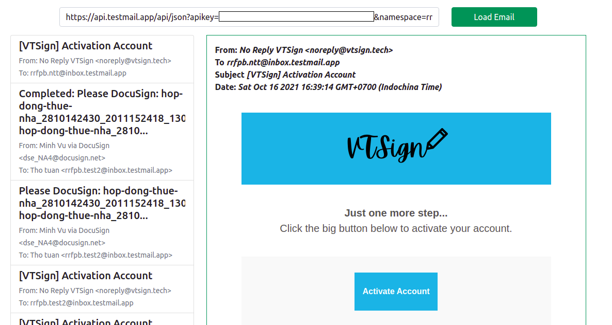

## testmail.app web client gui

You can easily view testmail.app's email in interface



### Using with nodejs

```sh
    git clone https://github.com/ngthotuan/testmail.app.git
    npm install
    npm start
```
-  After that go to: http://localhost:3000/ and enjoy

### Using with docker
```sh
    docker run -p 3000:80 -d ngthotuan/testmail.app
```
- After that go to: http://localhost:3000/ and enjoy